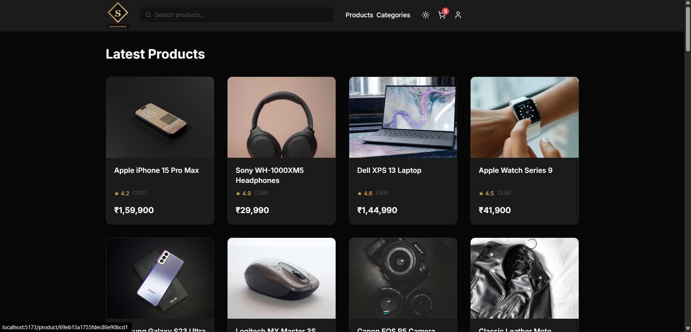
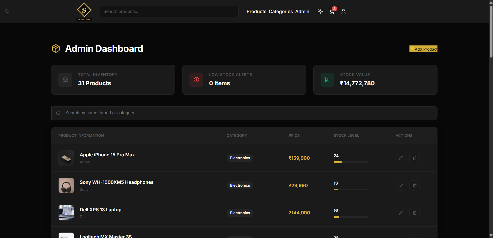
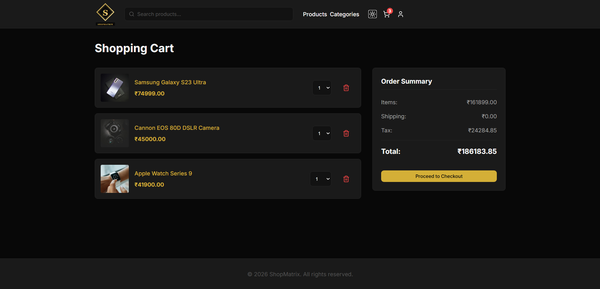
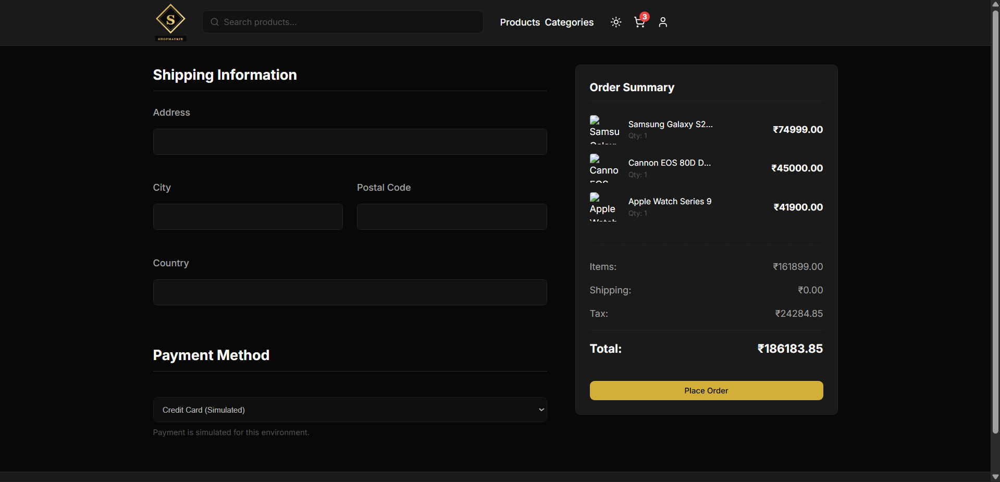
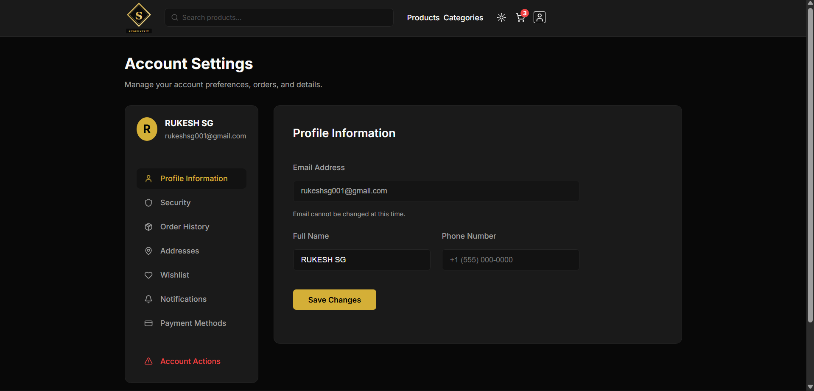
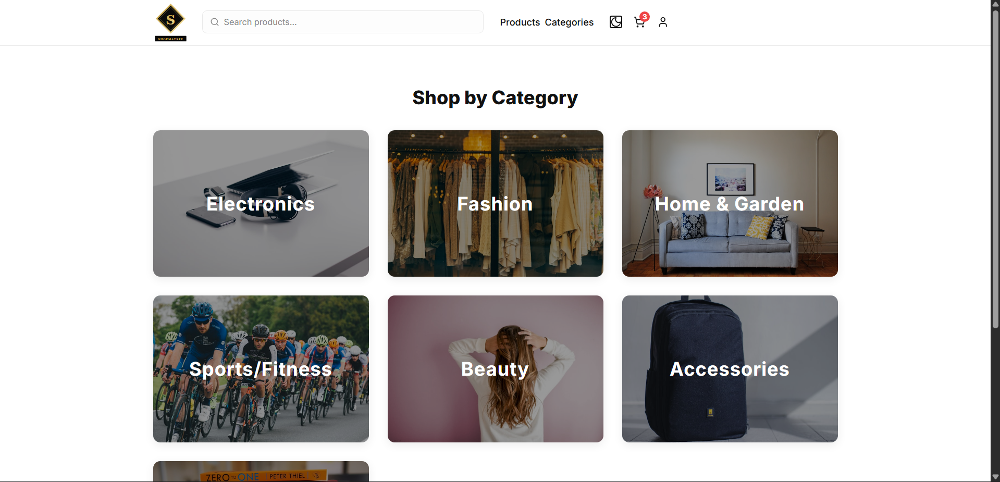

# 🛒 ShopMatrix – Premium E-Commerce Platform


ShopMatrix is a premium, full-stack luxury e-commerce platform designed to provide a seamless and elegant shopping experience. Built with the **MERN Stack**, it features a sophisticated UI, secure authentication, and a robust administrative system for business management.

---

### 🔗 Live Demo

<p align="center">
  <a href="https://shop-matrix-e-commerce-website.vercel.app/" target="_blank">
    
  </a>
  <br/><br/>
  <a href="https://shopmatrix-backend.onrender.com/" target="_blank">
    
  </a>
</p>

---

## 📸 Visual Showcase


## 🎥 Demo Video

<div align="center">

<a href="https://raw.githubusercontent.com/rukeshsg/ShopMatrix-E-Commerce-website/main/assets/video.mp4">
  
</a>

<p><b>▶️ Click image to watch demo</b></p>

</div>

---

### 🏠 Home Page
<div align="center">
  
</div>

### 🎨 Admin Management Dashboard
<div align="center">
  
</div>

### 🛒 Shopping Cart & Checkout
<div align="center">
  
  
</div>

### ⚙️ User Settings & 📂 Categories
<div align="center">
  
  
</div>


## ✨ Key Features

-   🔐 **Advanced Authentication**: JWT-based auth with HttpOnly cookies, access/refresh token rotation, and multi-layered route protection.
-   🛠️ **Powerful Admin Suite**: Comprehensive dashboard to Add, Edit, and Delete products, track inventory value, and monitor low-stock levels with visual progress bars.
-   🛍️ **Dynamic Shopping**: Real-time product search, category filtering, and an optimistic UI cart system.
-   👤 **Personalized Experience**: User dashboard for profile management, security settings (password updates), and order tracking.
-   🎨 **Luxury UI/UX**: Professional design supporting both **Light & Dark modes**, custom SVG branding, and high-quality local asset serving.
-   📧 **Email Notifications**: Integrated Nodemailer system for account verification and security alerts.

---

## 🚀 Tech Stack

**Frontend:**
-   **React 19** (Vite)
-   **Zustand** (Ultra-fast State Management)
-   **React Router 7**
-   **Lucide React** (Premium Icons)
-   **Sonner** (Modern Toasts)
-   **Axios** (API Interceptors)

**Backend:**
-   **Node.js & Express.js**
-   **MongoDB & Mongoose** (ODM)
-   **Bcrypt.js** (Secure Hashing)
-   **Express Rate Limit & Helmet** (Production Security)
-   **Nodemailer** (Email Services)

---

## 🛠️ Installation & Setup

### 1. Clone the repository
```bash
git clone https://github.com/your-username/shopmatrix.git
cd shopmatrix
```

### 2. Environment Configuration
Create a `.env` file in the `backend/` folder:
```env
PORT=5000
MONGO_URI=your_mongodb_connection_string
JWT_SECRET=your_jwt_secret
JWT_REFRESH_SECRET=your_refresh_secret
SMTP_EMAIL=your_email
SMTP_PASSWORD=your_app_password
```

### 3. Quick Start (Concurrently)
From the root directory:
```bash
npm install           # Install root dependencies
npm run install-all   # Install frontend & backend dependencies
npm run seed          # Populate with premium product data
npm run dev           # Start both servers
```

---

## 🔑 Admin Access (Test Account)
To test the administrative features:
-   **Email**: `admin@example.com`
-   **Password**: `password123`

---

## 📡 API Overview

| Method | Endpoint | Description |
| :--- | :--- | :--- |
| `POST` | `/api/auth/login` | Login & receive secure cookies |
| `GET` | `/api/products` | Search & Filter catalog |
| `POST` | `/api/products` | Create new product (Admin Only) |
| `PUT` | `/api/products/:id` | Edit inventory item (Admin Only) |
| `DELETE` | `/api/products/:id` | Remove product (Admin Only) |

---

Made with ❤️ by [Rukesh S G]
